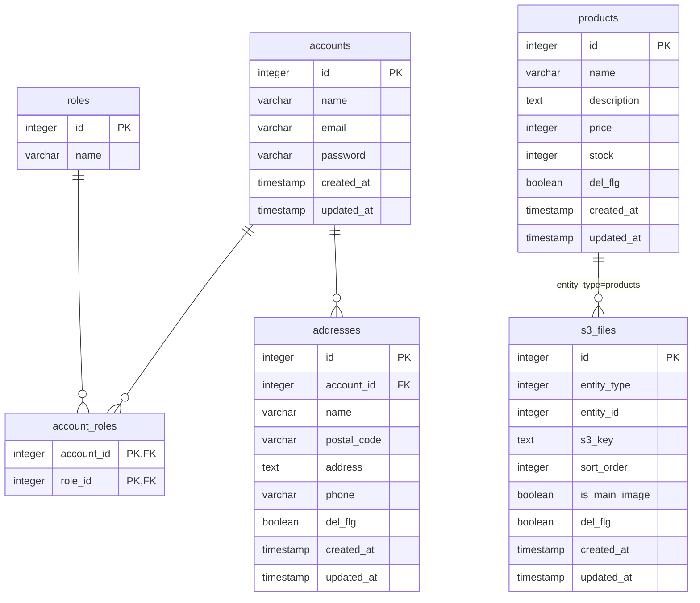

# DB Schema

ローカル環境: PostgreSQL (localhost:5433 / DB: ecdb)

## 接続

```bash
docker exec $(docker ps --filter "name=postgresdb" -q) psql -U ecuser -d ecdb -c "<SQL>"
```

---

## テーブル一覧

### accounts（ユーザーアカウント）

| カラム     | 型        | 制約                       |
|------------|-----------|----------------------------|
| id         | integer   | PK, GENERATED BY DEFAULT   |
| name       | varchar   | NOT NULL                   |
| email      | varchar   | NOT NULL, UNIQUE           |
| password   | varchar   | NOT NULL（BCryptハッシュ） |
| created_at | timestamp | NOT NULL, DEFAULT NOW()    |
| updated_at | timestamp | NOT NULL, DEFAULT NOW()    |

---

### roles（権限マスタ）

| カラム | 型          | 制約             |
|--------|-------------|------------------|
| id     | integer     | PK, GENERATED    |
| name   | varchar(50) | NOT NULL, UNIQUE |

固定データ: `id=1: ADMIN` / `id=2: USER`

---

### account_roles（アカウントと権限の中間テーブル）

| カラム     | 型      | 制約                                     |
|------------|---------|------------------------------------------|
| account_id | integer | PK, FK → accounts(id) ON DELETE CASCADE  |
| role_id    | integer | PK, FK → roles(id) ON DELETE CASCADE     |

---

### addresses（配送先住所）

| カラム      | 型           | 制約                         |
|-------------|--------------|------------------------------|
| id          | integer      | PK, GENERATED BY DEFAULT     |
| account_id  | integer      | NOT NULL, FK → accounts(id)  |
| name        | varchar(255) | NOT NULL                     |
| postal_code | varchar(20)  | NOT NULL                     |
| address     | text         | NOT NULL                     |
| phone       | varchar(20)  | NULL可                        |
| del_flg     | boolean      | DEFAULT false                |
| created_at  | timestamp    | DEFAULT NOW()                |
| updated_at  | timestamp    | DEFAULT NOW()                |

---

### products（商品）

| カラム      | 型           | 制約                    |
|-------------|--------------|-------------------------|
| id          | integer      | PK, GENERATED ALWAYS    |
| name        | varchar(255) | NOT NULL                |
| description | text         | NOT NULL                |
| price       | integer      | NOT NULL                |
| stock       | integer      | NOT NULL, DEFAULT 0     |
| created_at  | timestamp    | NOT NULL, DEFAULT NOW() |
| updated_at  | timestamp    | NOT NULL, DEFAULT NOW() |
| del_flg     | boolean      | NOT NULL, DEFAULT false |

論理削除方式（`del_flg = true` が削除済み）。

---

### s3_files（S3/MinIO ファイルメタデータ）

| カラム        | 型        | 制約                              |
|---------------|-----------|-----------------------------------|
| id            | integer   | PK, GENERATED ALWAYS              |
| entity_type   | integer   | NOT NULL（`EntityType` enum 値）  |
| entity_id     | integer   | NOT NULL（対象エンティティの ID） |
| s3_key        | text      | NOT NULL（S3 オブジェクトキー）   |
| sort_order    | integer   | NOT NULL, DEFAULT 0               |
| is_main_image | boolean   | NOT NULL, DEFAULT false           |
| created_at    | timestamp | NOT NULL, DEFAULT NOW()           |
| updated_at    | timestamp | NOT NULL, DEFAULT NOW()           |
| del_flg       | boolean   | NOT NULL, DEFAULT false           |

`entity_type` + `entity_id` でポリモーフィックに対象エンティティを参照。`EntityType` enum は `app/src/main/java/com/example/app/enums/EntityType.java` で定義。

---

## ER図



---

## マイグレーション

- 本番用: `app/src/main/resources/db/migration/V*.sql`
- テスト用: `app/src/test/resources/db/migration/V*.sql`
