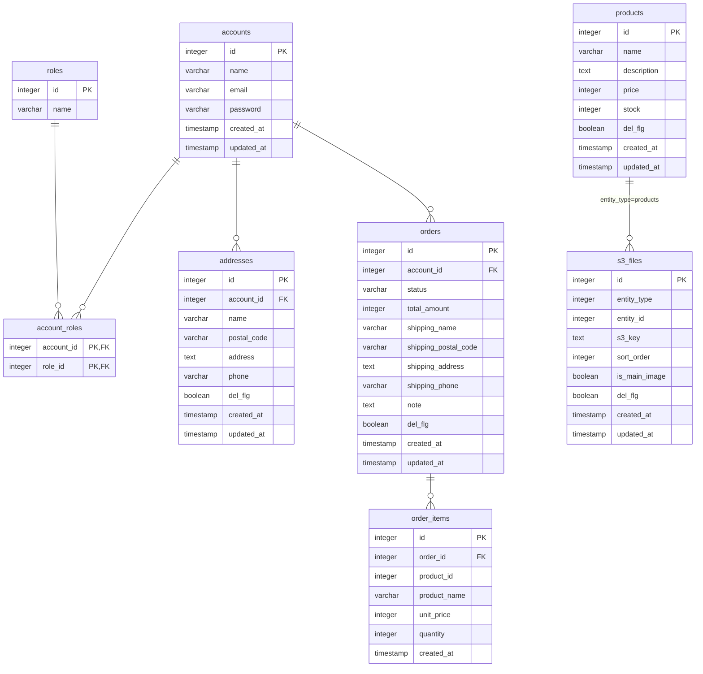

# DB Schema

ローカル環境: PostgreSQL (localhost:5433 / DB: ecdb)

## 接続

```bash
docker exec $(docker ps --filter "name=postgresdb" -q) psql -U ecuser -d ecdb -c "<SQL>"
```

---

## テーブル一覧

### accounts（ユーザーアカウント）

会員の認証情報を管理する。メールアドレスでログインし、BCryptでパスワードをハッシュ化して保存する。


| 物理名     | 論理名     | 型        | 制約                     | 説明                                       |
|------------|------------|-----------|--------------------------|--------------------------------------------|
| id         | アカウントID | integer   | PK, GENERATED BY DEFAULT | アカウントの一意識別子                     |
| name       | 氏名       | varchar   | NOT NULL                 | 表示名                                     |
| email      | メールアドレス | varchar   | NOT NULL, UNIQUE         | ログインID。一意                            |
| password   | パスワード | varchar   | NOT NULL                 | BCryptハッシュ済みのパスワード             |
| created_at | 作成日時   | timestamp | NOT NULL, DEFAULT NOW()  | レコード作成時刻                           |
| updated_at | 更新日時   | timestamp | NOT NULL, DEFAULT NOW()  | レコード更新時刻                           |

---

### roles（権限マスタ）

ロール（権限）のマスタテーブル。ADMIN / USER の2種類が固定で存在する。


| 物理名 | 論理名     | 型          | 制約             | 説明                          |
|--------|------------|-------------|------------------|-------------------------------|
| id     | ロールID   | integer     | PK, GENERATED    | ロールの一意識別子            |
| name   | ロール名   | varchar(50) | NOT NULL, UNIQUE | `ADMIN` / `USER` のいずれか   |

固定データ: `id=1: ADMIN` / `id=2: USER`

---

### account_roles（アカウントと権限の中間テーブル）

accountsとrolesの多対多リレーションを管理する。1アカウントに複数ロールを付与できる。


| 物理名     | 論理名       | 型      | 制約                                    | 説明                              |
|------------|--------------|---------|-----------------------------------------|-----------------------------------|
| account_id | アカウントID | integer | PK, FK → accounts(id) ON DELETE CASCADE | 紐づくアカウント                   |
| role_id    | ロールID     | integer | PK, FK → roles(id) ON DELETE CASCADE    | 付与されたロール                   |

---

### addresses（配送先住所）

会員の住所帳。注文時に「この住所を保存する」を選択した場合に登録される。注文テーブル（orders）とは独立しており、住所変更・削除しても注文履歴には影響しない。


| 物理名      | 論理名       | 型           | 制約                        | 説明                                  |
|-------------|--------------|--------------|-----------------------------|---------------------------------------|
| id          | 住所ID       | integer      | PK, GENERATED BY DEFAULT    | 住所の一意識別子                      |
| account_id  | アカウントID | integer      | NOT NULL, FK → accounts(id) | 所有アカウント                        |
| name        | 宛名         | varchar(255) | NOT NULL                    | 受取人氏名                            |
| postal_code | 郵便番号     | varchar(20)  | NOT NULL                    | ハイフン込みの郵便番号                |
| address     | 住所         | text         | NOT NULL                    | 都道府県以降の住所                    |
| phone       | 電話番号     | varchar(20)  | NULL可                       | 受取人電話番号                        |
| del_flg     | 削除フラグ   | boolean      | DEFAULT false               | 論理削除フラグ                        |
| created_at  | 作成日時     | timestamp    | DEFAULT NOW()               | レコード作成時刻                      |
| updated_at  | 更新日時     | timestamp    | DEFAULT NOW()               | レコード更新時刻                      |

---

### products（商品）

販売商品のマスタテーブル。論理削除方式（`del_flg = true` が削除済み）を採用し、削除済み商品は一覧から除外される。


| 物理名      | 論理名     | 型           | 制約                    | 説明                                  |
|-------------|------------|--------------|-------------------------|---------------------------------------|
| id          | 商品ID     | integer      | PK, GENERATED ALWAYS    | 商品の一意識別子                      |
| name        | 商品名     | varchar(255) | NOT NULL                | 表示名                                |
| description | 商品説明   | text         | NOT NULL                | 商品説明文                            |
| price       | 価格       | integer      | NOT NULL                | 税込み価格（円）                      |
| stock       | 在庫数     | integer      | NOT NULL, DEFAULT 0     | 現在の在庫数。0 で在庫切れ            |
| created_at  | 作成日時   | timestamp    | NOT NULL, DEFAULT NOW() | レコード作成時刻                      |
| updated_at  | 更新日時   | timestamp    | NOT NULL, DEFAULT NOW() | レコード更新時刻                      |
| del_flg     | 削除フラグ | boolean      | NOT NULL, DEFAULT false | 論理削除フラグ                        |

---

### s3_files（S3/MinIO ファイルメタデータ）

S3（本番）/ MinIO（ローカル）に保存したファイルのメタデータを管理する。`entity_type` + `entity_id` でポリモーフィックに対象エンティティ（商品など）と紐づける設計のため、複数エンティティの画像を1テーブルで管理できる。


| 物理名        | 論理名             | 型        | 制約                    | 説明                                       |
|---------------|--------------------|-----------|-------------------------|--------------------------------------------|
| id            | ファイルID         | integer   | PK, GENERATED ALWAYS    | ファイルメタの一意識別子                   |
| entity_type   | エンティティ種別   | integer   | NOT NULL                | `EntityType` enum 値                       |
| entity_id     | エンティティID     | integer   | NOT NULL                | 対象エンティティの ID（例: 商品ID）         |
| s3_key        | S3キー             | text      | NOT NULL                | S3 オブジェクトキー                        |
| sort_order    | 並び順             | integer   | NOT NULL, DEFAULT 0     | 表示順序                                   |
| is_main_image | メイン画像フラグ   | boolean   | NOT NULL, DEFAULT false | メイン画像なら true                        |
| created_at    | 作成日時           | timestamp | NOT NULL, DEFAULT NOW() | レコード作成時刻                           |
| updated_at    | 更新日時           | timestamp | NOT NULL, DEFAULT NOW() | レコード更新時刻                           |
| del_flg       | 削除フラグ         | boolean   | NOT NULL, DEFAULT false | 論理削除フラグ                             |

`entity_type` + `entity_id` でポリモーフィックに対象エンティティを参照。`EntityType` enum は `app/src/main/java/com/example/app/enums/EntityType.java` で定義。

---

### orders（注文）

会員からの注文ヘッダ。配送先情報を注文時のスナップショットとして保持する（住所マスタが変更されても注文履歴は不変）。`status` で注文の進行段階を表す。

| 物理名               | 論理名             | 型           | 制約                          | 説明                                          |
|----------------------|--------------------|--------------|-------------------------------|-----------------------------------------------|
| id                   | 注文ID             | integer      | PK, GENERATED ALWAYS          | 注文の一意識別子                              |
| account_id           | アカウントID       | integer      | FK → accounts(id)             | 注文した会員                                  |
| status               | 注文ステータス     | varchar(50)  | NOT NULL, DEFAULT `'PENDING'` | 注文の進行段階                                |
| total_amount         | 合計金額           | integer      | NOT NULL                      | 注文時点の合計金額（円）                      |
| shipping_name        | 配送先 宛名        | varchar(255) | NOT NULL                      | 注文時点のスナップショット                    |
| shipping_postal_code | 配送先 郵便番号    | varchar(20)  | NOT NULL                      | 注文時点のスナップショット                    |
| shipping_address     | 配送先 住所        | text         | NOT NULL                      | 注文時点のスナップショット                    |
| shipping_phone       | 配送先 電話番号    | varchar(20)  | NULL可                         | 注文時点のスナップショット                    |
| note                 | 備考               | text         | NULL可                         | 注文時の備考                                  |
| del_flg              | 削除フラグ         | boolean      | NOT NULL, DEFAULT false       | 論理削除フラグ                                |
| created_at           | 作成日時           | timestamp    | NOT NULL, DEFAULT NOW()       | 注文日時として使用                            |
| updated_at           | 更新日時           | timestamp    | NOT NULL, DEFAULT NOW()       | ステータス変更時に更新                        |

`status` の取りうる値: `PENDING` / `CONFIRMED` / `SHIPPED` / `DELIVERED` / `CANCELLED`

---

### order_items（注文明細）

注文に含まれる商品の明細。商品名・単価は注文時点のスナップショットを保持する（商品マスタが変更・削除されても注文履歴は不変）。画像情報は持たないため、表示時は現在の `s3_files` を参照する（商品削除済みなら NO_IMAGE）。

| 物理名       | 論理名     | 型           | 制約                       | 説明                                              |
|--------------|------------|--------------|----------------------------|---------------------------------------------------|
| id           | 明細ID     | integer      | PK, GENERATED ALWAYS       | 明細の一意識別子                                  |
| order_id     | 注文ID     | integer      | NOT NULL, FK → orders(id)  | 紐づく注文                                        |
| product_id   | 商品ID     | integer      | NOT NULL                   | 注文された商品ID（FK制約なし: 商品削除でも残す）   |
| product_name | 商品名     | varchar(255) | NOT NULL                   | 注文時点のスナップショット                        |
| unit_price   | 単価       | integer      | NOT NULL                   | 注文時点の単価（円）                              |
| quantity     | 数量       | integer      | NOT NULL                   | 注文数量                                          |
| created_at   | 作成日時   | timestamp    | NOT NULL, DEFAULT NOW()    | レコード作成時刻                                  |

---

## ER図



---

## マイグレーション

- 本番用: `app/src/main/resources/db/migration/V*.sql`
- テスト用: `app/src/test/resources/db/migration/V*.sql`
