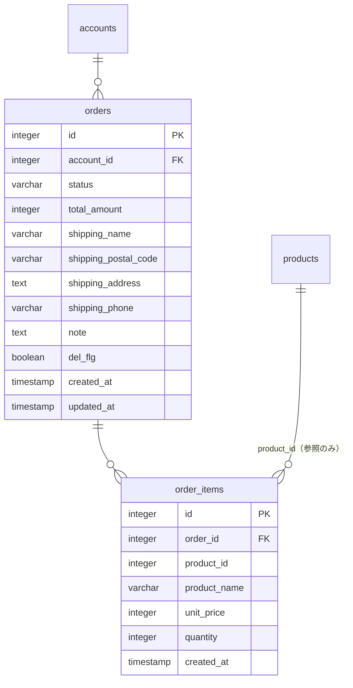
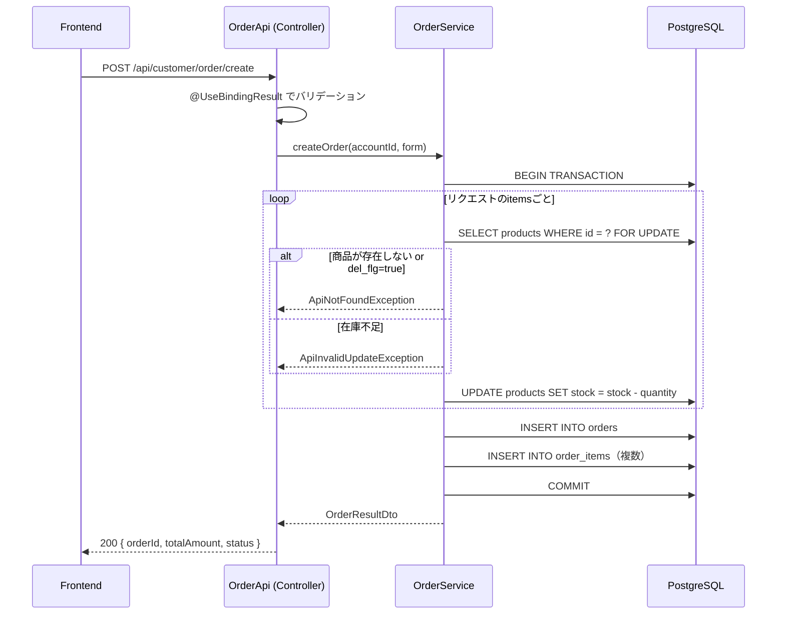

# 注文作成機能 詳細設計書

## 概要

会員がカートの内容をもとに注文を確定する機能。  
ゲスト購入はDB設計上は余地を残すが、現フェーズでは会員のみ対応する。

---

## 住所設計の方針

一般的なECサイト（Amazon等）の標準フローに準拠する。

### 標準フロー

```
【会員登録】
  → 名前・メール・パスワードのみ収集。住所は登録しない。

【注文時（毎回）】
  → チェックアウト画面で配送先を手入力
  → 入力内容を orders テーブルにスナップショット保存
  → （任意）「この住所を保存する」チェックで addresses テーブルにも登録

【2回目以降の注文】
  → 保存済み住所から選択 or 新規入力
  → 選択・入力内容を orders テーブルにスナップショット保存

【マイページ】
  → 住所帳の管理（追加・編集・削除）
```

### 現フェーズと将来フェーズの分担

| 機能 | 現フェーズ | 将来フェーズ |
|---|---|---|
| チェックアウトで住所手入力 → orders に保存 | ✅ 実装 | - |
| 「住所を保存する」→ addresses に登録 | ❌ スコープ外 | ✅ |
| マイページで住所帳管理 | ❌ スコープ外 | ✅ |
| 保存済み住所から選択してチェックアウト | ❌ スコープ外 | ✅ |
| ゲスト購入（account_id = NULL） | ❌ スコープ外 | ✅ |

### テーブルの役割

- `orders.shipping_*`: 注文時点の配送先スナップショット。住所変更の影響を受けない。
- `addresses`: 将来の住所帳機能で使用。現フェーズでは参照しない。

---

## DB設計

### ordersテーブル（新規）

| カラム              | 型           | 制約                        | 説明                                 |
|---------------------|--------------|-----------------------------|--------------------------------------|
| id                  | integer      | PK, GENERATED ALWAYS        |                                      |
| account_id          | integer      | NULL可, FK → accounts(id)   | ゲスト購入時はNULL（現フェーズ未使用）|
| status              | varchar(50)  | NOT NULL, DEFAULT 'PENDING' | 注文ステータス（現フェーズはPENDINGのみ）|
| total_amount        | integer      | NOT NULL                    | 合計金額（税込）                     |
| shipping_name       | varchar(255) | NOT NULL                    | 配送先氏名                           |
| shipping_postal_code| varchar(20)  | NOT NULL                    | 配送先郵便番号                       |
| shipping_address    | text         | NOT NULL                    | 配送先住所                           |
| shipping_phone      | varchar(20)  | NULL可                      | 配送先電話番号                       |
| note                | text         | NULL可                      | 備考                                 |
| del_flg             | boolean      | NOT NULL, DEFAULT false      |                                      |
| created_at          | timestamp    | NOT NULL, DEFAULT NOW()     |                                      |
| updated_at          | timestamp    | NOT NULL, DEFAULT NOW()     |                                      |

### order_itemsテーブル（新規）

| カラム       | 型           | 制約                      | 説明                                     |
|--------------|--------------|---------------------------|------------------------------------------|
| id           | integer      | PK, GENERATED ALWAYS      |                                          |
| order_id     | integer      | NOT NULL, FK → orders(id) |                                          |
| product_id   | integer      | NOT NULL                  | 注文時点のproduct_id（参照用）           |
| product_name | varchar(255) | NOT NULL                  | 注文時点の商品名（スナップショット）     |
| unit_price   | integer      | NOT NULL                  | 注文時点の単価（スナップショット）       |
| quantity     | integer      | NOT NULL                  | 数量                                     |
| created_at   | timestamp    | NOT NULL, DEFAULT NOW()   |                                          |

> `product_name` / `unit_price` は注文後に商品情報が変更されても履歴が保たれるようスナップショットとして保存する。

### ER図（追記分）



### Flywayマイグレーション

`V6__add_order_tables.sql` として追加する。

---

## API設計

### POST /api/customer/order/create

注文を作成する。会員のみ利用可（`/api/customer/**` のため USER or ADMIN ロールが必要）。

#### リクエスト

```json
{
  "shippingName": "山田 太郎",
  "shippingPostalCode": "123-4567",
  "shippingAddress": "東京都渋谷区〇〇1-2-3",
  "shippingPhone": "090-1234-5678",
  "note": "午前中に届けてください",
  "items": [
    {
      "productId": 10,
      "quantity": 2
    },
    {
      "productId": 20,
      "quantity": 1
    }
  ]
}
```

| フィールド         | 型      | 必須 | バリデーション              |
|--------------------|---------|------|-----------------------------|
| shippingName       | string  | ✅   | 最大255文字                 |
| shippingPostalCode | string  | ✅   | 最大20文字                  |
| shippingAddress    | string  | ✅   | テキスト                    |
| shippingPhone      | string  | -    | 最大20文字                  |
| note               | string  | -    | テキスト                    |
| items              | array   | ✅   | 1件以上                     |
| items[].productId  | integer | ✅   | 存在する商品ID              |
| items[].quantity   | integer | ✅   | 1以上                       |

#### レスポンス（成功 200）

```json
{
  "status": 200,
  "data": {
    "orderId": 1,
    "totalAmount": 5000,
    "status": "PENDING"
  }
}
```

#### エラーレスポンス

**400 バリデーションエラー**

```json
{
  "status": "error",
  "error": {
    "code": 400,
    "message": "入力値に誤りがあります",
    "fieldError": {
      "shippingName": ["配送先氏名は必須です"],
      "items": ["1件以上の商品が必要です"]
    }
  }
}
```

**400 在庫不足**

```json
{
  "status": "error",
  "error": {
    "code": 400,
    "message": "在庫が不足しています: カバンA"
  }
}
```

**404 商品が存在しない / 削除済み**

```json
{
  "status": "error",
  "error": {
    "code": 404,
    "message": "商品が見つかりません: 10"
  }
}
```

**401 未認証**

```json
{
  "message": "unauthorized"
}
```

---

## シーケンス図



---

## 実装クラス構成

```
rest/
  └── OrderApi.java                  # POST /api/customer/order/create

form/
  └── OrderCreateForm.java           # リクエストのバインド・バリデーション
  └── OrderItemForm.java             # items の各要素

dto/
  └── OrderResultDto.java            # レスポンス

service/
  └── OrderService.java              # インターフェース
  └── impl/OrderServiceImpl.java     # 在庫チェック・減算・INSERT

mapper/
  └── OrderMapper.java               # orders / order_items のINSERT
  └── ProductMapper.java             # 既存。stock更新メソッドを追加

resources/mapper/
  └── OrderMapper.xml                # MyBatis SQL

resources/db/migration/
  └── V6__add_order_tables.sql       # orders / order_items テーブル作成
```

---

## 処理詳細

### OrderServiceImpl.createOrder()

1. `@Transactional` で囲む
2. `items` をループし、各 `productId` を `SELECT ... FOR UPDATE` で取得（悲観ロック）
3. 商品が存在しない or `del_flg=true` → `ApiNotFoundException` をスロー
4. `stock < quantity` → `ApiInvalidUpdateException` をスロー
5. `UPDATE products SET stock = stock - quantity WHERE id = ?`
6. 全商品のチェック・更新が完了したら `orders` にINSERT
7. `order_items` に各明細をINSERT
8. `total_amount` = `Σ(unit_price × quantity)` をアプリ側で計算してordersに保存

### バリデーション

- `OrderApi` に `@UseBindingResult` を付与し、`ApiValidationAspect` に委譲（既存パターン）
- `items` が空の場合は `@Size(min=1)` でエラー

---

## 未対応事項（今フェーズのスコープ外）

### 住所まわり
- 注文時に「この住所を保存する」→ addresses テーブルへの登録（`saveAddress` フィールド追加・重複チェックも必要）
- マイページでの住所帳管理（追加・編集・削除）
- 保存済み住所の選択UI（チェックアウト画面での addresses 一覧取得API）
- ゲスト購入（`account_id = NULL` のフロー）

### 注文まわり
- 注文ステータス更新API（PENDING → CONFIRMED → SHIPPED → DELIVERED）
- 注文履歴取得API（`GET /api/customer/orders`）
- 管理者向け注文管理API
- 決済連携
