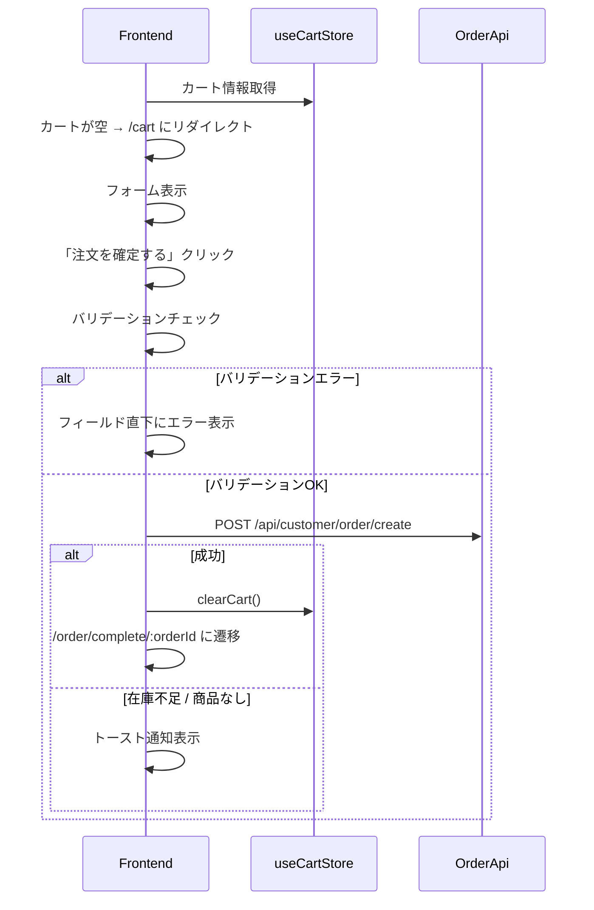

# チェックアウト機能 詳細設計書（フロントエンド）

## 概要

カートの内容をもとに配送先を入力し、注文を確定する画面。  
会員のみ利用可能（未認証の場合はログインページへリダイレクト）。

---

## 画面設計

### URL

`/checkout`

### レイアウト（左右2カラム）

```
┌──────────────────────┬─────────────────┐
│ 配送先情報            │ 注文内容         │
│  氏名                │  商品名 × 数量   │
│  郵便番号             │  小計           │
│  住所                │  ─────────────  │
│  電話番号（任意）      │  合計金額: ¥X,X │
│  備考（任意）         │                 │
│                      │ [注文を確定する]  │
└──────────────────────┴─────────────────┘
```

### フォーム項目

| 項目 | フィールド名 | 必須 | バリデーション | 備考 |
|---|---|---|---|---|
| 配送先氏名 | shippingName | ✅ | 最大255文字 | |
| 郵便番号 | shippingPostalCode | ✅ | XXX-XXXX形式 | |
| 配送先住所 | shippingAddress | ✅ | | |
| 電話番号 | shippingPhone | - | 最大20文字 | |
| 備考 | note | - | | |

---

## 画面遷移

```
カートページ（/cart）
  └── 「注文に進む」リンク
        └── チェックアウト画面（/checkout）
              ├── 注文確定成功 → 注文完了画面（/order/complete/:orderId）
              │                   ※ clearCart() でカートを空にする
              └── カートが空で直接アクセス → カートページ（/cart）にリダイレクト
```

---

## エラーハンドリング

| エラー種別 | 表示方法 | 例 |
|---|---|---|
| バリデーションエラー | フィールド直下に表示（react-hook-form） | 「郵便番号はXXX-XXXXの形式で入力してください」 |
| 在庫不足（400） | トースト通知（react-hot-toast） | 「商品名が在庫不足です」 |
| 商品が存在しない（404） | トースト通知（react-hot-toast） | 「商品が見つかりません」 |

---

## シーケンス図



---

## 実装クラス構成

```
frontend/src/
  components/
    pages/
      CheckOutPage.tsx          # チェックアウト画面（フォームを直接実装）
      OrderCompletePage.tsx     # 注文完了画面
    organisms/
      OrderSummary.tsx          # 注文内容表示

  hooks/
    useCreateOrder.ts           # 注文作成APIフック

  types/
    Order.ts                    # 注文関連の型定義
```

---

## APIリクエスト

### POST /api/customer/order/create

```json
{
  "shippingName": "山田 太郎",
  "shippingPostalCode": "123-4567",
  "shippingAddress": "東京都渋谷区〇〇1-2-3",
  "shippingPhone": "090-1234-5678",
  "note": "午前中に届けてください",
  "items": [
    { "productId": 1, "quantity": 2 },
    { "productId": 2, "quantity": 1 }
  ]
}
```

### レスポンス（成功）

```json
{
  "status": "success",
  "data": {
    "orderId": 1,
    "totalAmount": 5000,
    "status": "PENDING"
  }
}
```

---

## 未対応事項（スコープ外）

- 保存済み住所からの選択（住所帳機能）
- 「この住所を保存する」チェックボックス
- ゲスト購入
- 決済連携
- 氏名プリフィル（`me` に `name` フィールドがないため。BEへの追加が前提となる）
